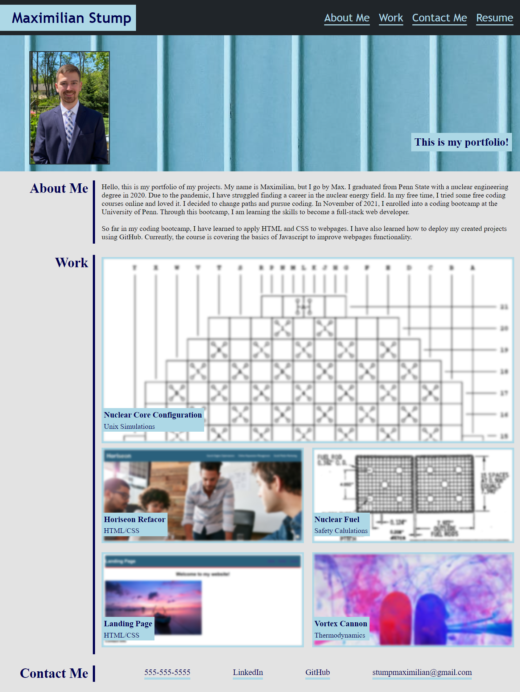
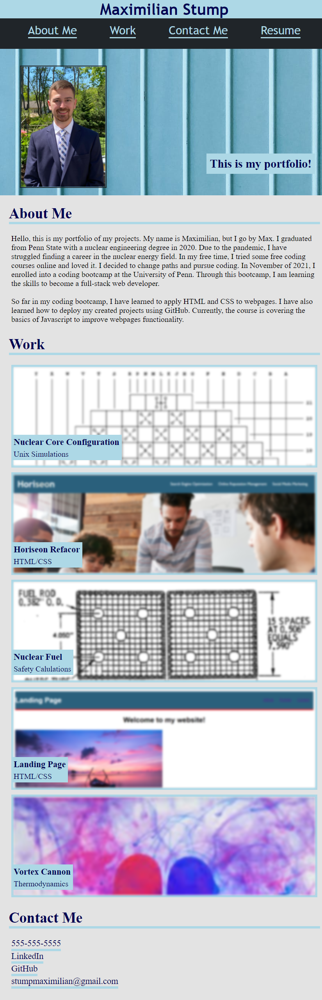

# portfolio

## Description
I was tasked with creating a personal portfolio to demonstrate personal projects to future employers. The goal was to make a webpage that is visually appealing with access to projects I have completed using HTML and CSS, specifically FlexBox. Utilizing flexbox, I was able to create a structured webpage that is both desktop and mobile friendly. I was able to include images with links embedded in them to my projects. I structured my HTML with semantic elements and alt tags for more accessibility. During the creation of my portfolio, I learned how to nest flexboxes effectively using containers. I also learned how to customize images in CSS more, and I gained a better understanding of padding, margins, and borders on elements.

## Table of Contents
- [Installation](#installation)
- [Usage](#usage)
- [Credits](#credits)
- [License](#license)
- [Features](#features)
## Installation
N/A

## Usage
Here is the deployed link to my portfolio. [My portfolio](https://maxstump13.github.io/portfolio/) Below is what the site looks like on screens larger than 768px and screens smaller than 768px. If one of the headers in the navigation is clicked, a scroll animation to that section is triggered. If the Resume header is clicked, another tab is opened to a resume. In the Work section, the images are blurred until hovered over. If one of the projects is clicked, a new tab is opened with that project. At the bottom, my contact information and profiles are listed with active links. 

## Credits
Here are the sources I used to create my portfolio.
1. https://css-tricks.com/
2. https://stackoverflow.com/
3. https://www.w3schools.com/default.asp
4. https://tutsplus.com/?_ga=2.56027243.1162466002.1638744344-1575437401.1638298985
5. https://developer.mozilla.org/en-US/
6. https://www.pexels.com/
7. https://www.youtube.com/watch?v=k32voqQhODc

## License
MIT License

Copyright (c) [2021] [Maximilian Stump]

Permission is hereby granted, free of charge, to any person obtaining a copy
of this software and associated documentation files (the "Software"), to deal
in the Software without restriction, including without limitation the rights
to use, copy, modify, merge, publish, distribute, sublicense, and/or sell
copies of the Software, and to permit persons to whom the Software is
furnished to do so, subject to the following conditions:

The above copyright notice and this permission notice shall be included in all
copies or substantial portions of the Software.

THE SOFTWARE IS PROVIDED "AS IS", WITHOUT WARRANTY OF ANY KIND, EXPRESS OR
IMPLIED, INCLUDING BUT NOT LIMITED TO THE WARRANTIES OF MERCHANTABILITY,
FITNESS FOR A PARTICULAR PURPOSE AND NONINFRINGEMENT. IN NO EVENT SHALL THE
AUTHORS OR COPYRIGHT HOLDERS BE LIABLE FOR ANY CLAIM, DAMAGES OR OTHER
LIABILITY, WHETHER IN AN ACTION OF CONTRACT, TORT OR OTHERWISE, ARISING FROM,
OUT OF OR IN CONNECTION WITH THE SOFTWARE OR THE USE OR OTHER DEALINGS IN THE
SOFTWARE.
🏆 The previous sections are the bare minimum, and your project will ultimately determine the content of this document. You might also want to consider adding the following sections.
## Badges
N/A

## Features
If your project has a lot of features, list them here.
1. Scroll animation when navigation clicked
2. Resume opens in new tab
3. Images in work section are linked to deployed link or report in new tab
4. Links in contact me go to profiles
5. Images are blurred until hovered on
6. Structure adjusts to smaller screens for easier use

## How to Contribute
N/A

## Tests
N/A